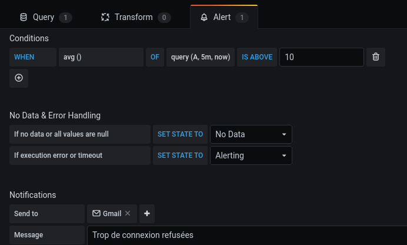

# TP10
<details>
<summary>Ennoncé du Tp</summary>

```
1- Ajoutez le canal d'alerte de votre choix (mail, discorde, slack, ...)
2- Ajoutez une alerte si il y a eu plus de 10 tentatives de connexions erronées à votre base de données dans les 5 dernières minutes
```

</details>  

## Grafana

On reprend le docker-compose du TP précédent en rajoutant le service SMTP, ce qui nous donne [ceci](docker-compose.yaml)

Après avoir lancé les containers, on peut aller sur `localhost:3000` qui nous affiche la page Grafana.

Il nous faut maintenant ajouter [un canal d'alerte](screenshots/alerting.png) ainsi que [la datasource Prometheus](screenshots/prometheus.png).

## Alerte

Après avoir ajouter un panel qui affiche [le nombre de tentatives de connexion refusées](screenshots/connexion.png) (obtenue grâce à la requête SQL : `mysql_global_status_access_denied_errors`), il faut aller dans l'onglet "Alerte" pour en créer une.

Nous voulons recevoir une alerte si il y a eu plus de 10 tentatives de connexions erronées à notre base de données dans les 5 dernières minutes.

Dans la partie Conditions il faut saisir ceci :

`WHEN avg() OF query(A, 5m, now) IS ABOVE 10`  

Pour que grafana nous envoie un alerte par email, dans la partie *Notification* il faut selectionner le canal d'alerte que nous avons créer au début (`Gmail`).  
Nous avons aussi la possibilité de saisir un message.




