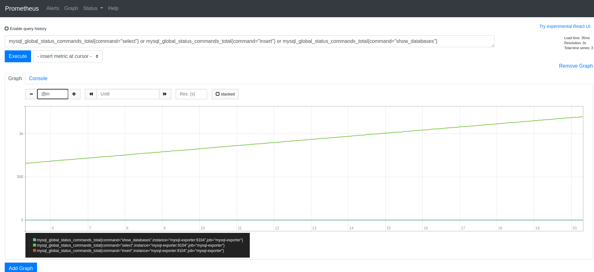
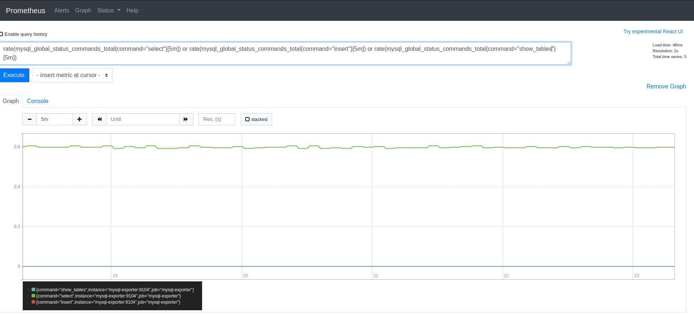

# TP8
<details>
<summary>Ennoncé du Tp</summary>

```
Première partie :

Créez un fichier docker-compose qui réunit

1. Un serveur mariaDB
2. Un serveur prometheus
3. Un serveur mysql-exporter

Et relier les entre eux.

Deuxième partie :

1. Créez un graphique qui affiche toutes les opérations de lectures et d'écritures.
2. Créez un graphique qui affiche la variation du taux d'opérations de lectures et d'écritures en prenant en compte la moyenne sur les 5 dernières minutes
```

</details>

### Fichier [docker-compose](docker-compose.yaml) qui réunit : 

 - Un serveur mariaDB
 - Un serveur prometheus
 - Un serveur mysql-exporter


Après avoir relié nos serveurs entre eux, Prometheus (`http://localhost:9090`) nous propose des commandes SQL nous donnant la possibilité de récupérer les données de notre serveur de base de données.

Nous pouvons créez un graphique qui comptera le nombre d'occurrence de la commande `SELECT` effectué sur notre serveur grâce à la commande : `mysql_global_status_commands_total{command="select"}`.



Pour avoir la moyenne des commandes `SELECT` par périodes de 5 minutes nous pouvons utiliser : `(mysql_global_status_commands_total{command="select"}[5m])`

