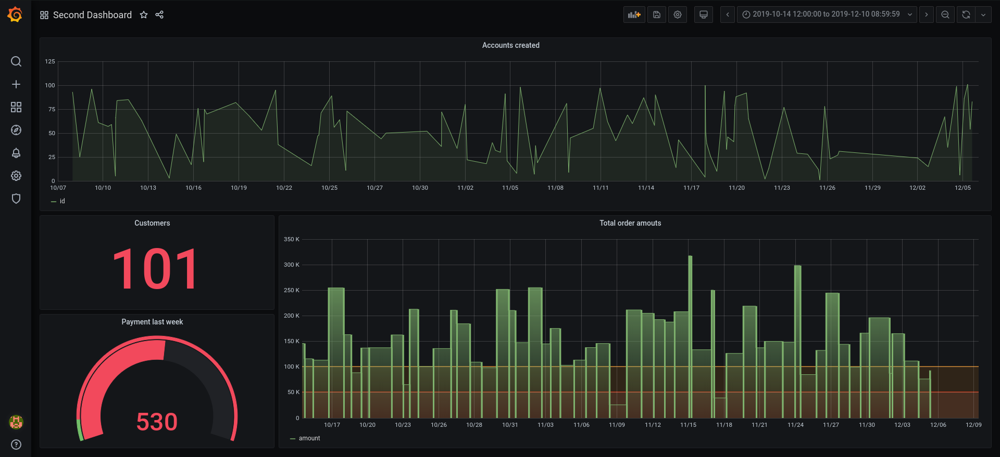

# TP9

On reprend le docker-compose du TP précédent en rajoutant le service grafana, ce qui nous donne [ceci](docker-compose.yaml)

Après avoir lancé les containers, on peut aller sur `localhost:3000` qui nous affiche la page Grafana.

Il nous faut maintenant ajouter [la datasource Prometheus](screenshots/prometheus.png).

### Première partie

#### Premier Dashboard :

Il y a plusieurs panels dans ce premier dashboard :

  - Un panel qui affiche un [graphique du taux d'opérations Read](screenshots/read.png) qu'on obtient grâce à la requête SQL : `mysql_global_status_innodb_data_pending_reads`.

  - Un panel qui affiche simplement [le nombre total de tentatives de connexion refusées](screenshots/connexion.png) obtenue grâce à la requête SQL : `mysql_global_status_access_denied_errors`.

  - Un panel sous forme de compteur (gauge) qui affiche [le temps nécessaire à l'exporter pour scrapper les données](screenshots/scrapper.png) obtenue grâce à la requête SQL : `mysql_exporter_collector_duration_seconds{collector="collect.global_variables"}`.

### Seconde partie

Il faut ajouter [la datasource Mysql](screenshots/mysql.png "mysql").

#### Second Dashboard :

Il y a donc plusieurs panels dans ce second dashboard avec leurs requêtes SQL respectives :  

  - [les comptes utilisateurs créés par jour](screenshots/account.png)
  - [le nombre total de clients](screenshots/customers.png)
  - [le nombre de payments de la semaine dernière](screenshots/payment.png)
  - [le volume de ventes par jour avec des indicateurs de performances](screenshots/amout.png)