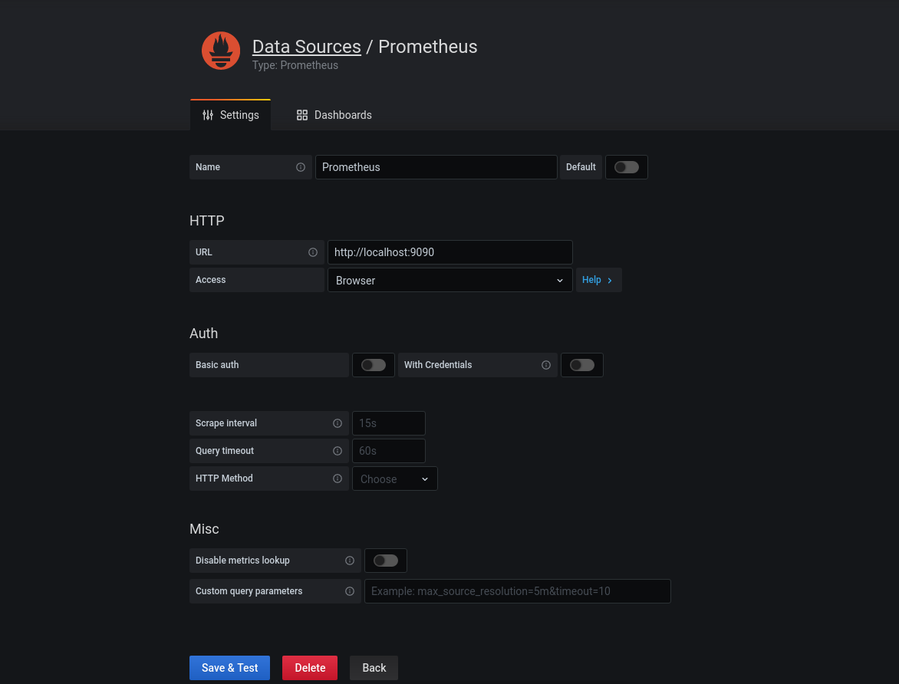
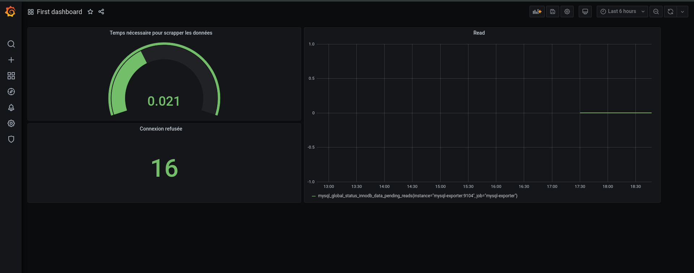
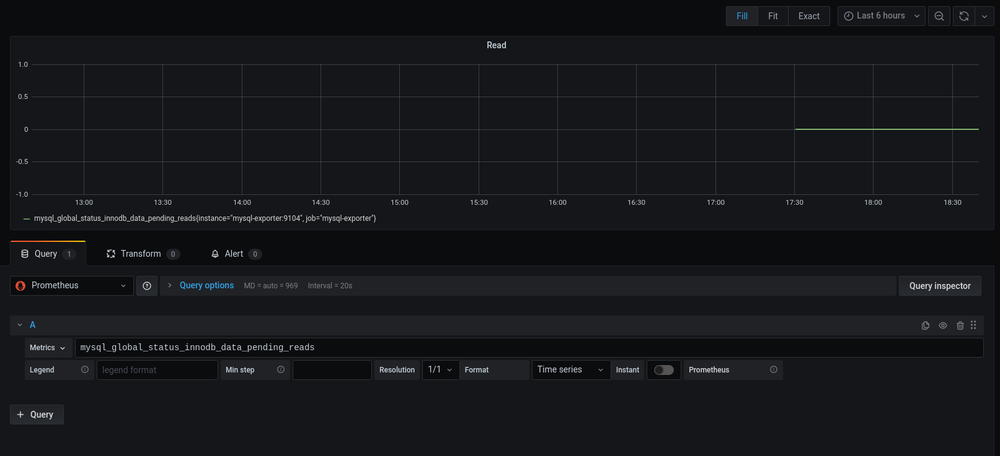
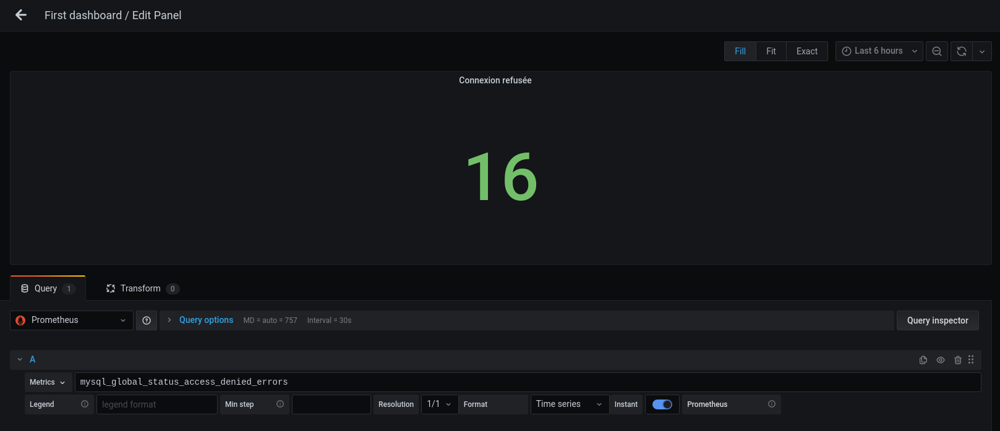
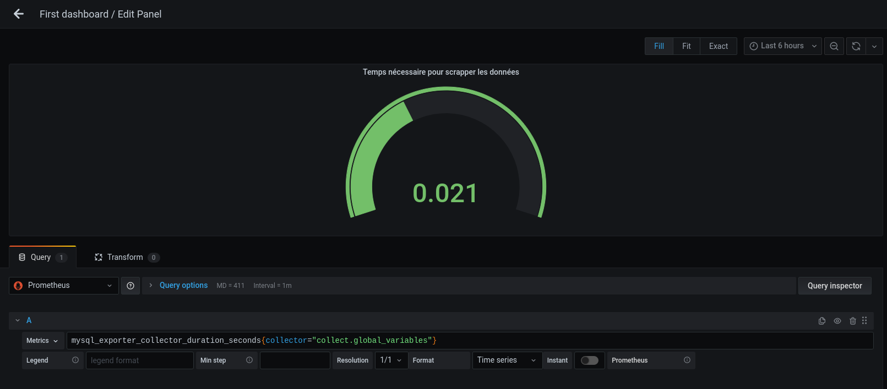

# TP9

On reprend le docker-compose du TP précédent en rajoutant le service grafana :

```
version: '3.7'

services: 
  maria-master:
    image: mariadb:10.5
    ports:
      - 3307:3307
    environment:
      MYSQL_ROOT_PASSWORD: password
    volumes:
      - ./mysql:/var/lib/mysql
      - ./backups:/backups
      - ./config/master.cnf:/etc/mysql/mariadb.conf.d/master.cnf
      - ./scripts:/scripts
    networks:
      - mynetwork
  prometheus:
    image: prom/prometheus:latest
    ports:
      - 9090:9090
    environment:
      MYSQL_ROOT_PASSWORD: password
    volumes:
      - ./backups:/backups
      - ./prometheus.yml:/etc/prometheus/prometheus.yml
    networks:
      - mynetwork
  mysql-exporter:
    image: prom/mysqld-exporter:latest
    ports:
      - 9104:9104
    environment:
      DATA_SOURCE_NAME: root:password@(maria-master:3306)/db_to_export
    volumes:
      - ./mysql:/var/lib/mysql
      - ./backups:/backups
      - ./config/master.cnf:/etc/mysql/mariadb.conf.d/master.cnf
      - ./scripts:/scripts
    networks:
      - mynetwork
  grafana:
    image: grafana/grafana
    ports:
      - 3000:3000
    networks:
      - mynetwork

networks:
  mynetwork:

```

Après avoir lancé les containers, on peut aller sur `localhost:3000` qui nous affiche la page Grafana.

Il nous faut maintenant ajouter la datasource Prometheus :



## Première partie

### Premier Dashboard :



Graphique du taux d'opérations READ  qu'on obtient grâce à la commande SQL `mysql_global_status_innodb_data_pending_reads` :



Un panel qui affiche simplement le nombre total de tentatives de connexion refusées obtenue grâce à la commande SQL `mysql_global_status_access_denied_errors` :



Un panel sous forme de compteur (gauge) qui affiche le temps nécessaire à l'exporter pour scrapper les données liées aux connexions depuis le serveur MariaDB obtenue grâce à la commande SQL `mysql_exporter_collector_duration_seconds{collector="collect.global_variables"}` :



## Seconde partie

Il faut ajouter la datasource Mysql : 